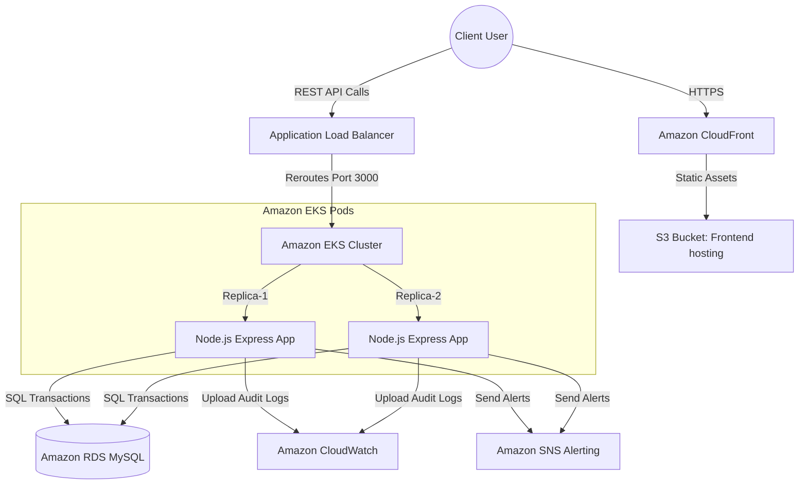

# Cloud-Based Personal Expense Tracker using AWS & DevOps

[](https://github.com)
[](https://aws.amazon.com)
[](https://kubernetes.io)
[](https://www.docker.com)
[](https://www.apache.org/licenses/LICENSE-2.0)

A secure, enterprise-ready **Personal Expense Tracker** designed to monitor, filter, and audit personal spending balances, engineered for high-availability deployments on AWS using robust container orchestration.

---

## 🚀 Key Features

- **FinOps Analytics Dashboard:** Staggered visual cards detailing Total Spending, Monthly Trajectory lines, and Category budget allocation percentages.
- **Transactional Audit Console:** Advanced multi-parameter filter systems (by Category, Payment Nodes, Date Ranges, and Spend Ranges) and dynamic CSV reports compilation.
- **Secure IAM Credentials:** Custom JWT authentication paired with secure pure-JS `bcrypt` password hashes on relational database schemas.
- **AWS DevOps Infrapanel:** Interactive built-in reference panel displaying pre-configured Dockerfiles, Kubernetes manifests, and Github CI/CD YAML configurations.
- **Robust Category Customization:** Add custom budget tags equipped with specialized colors and preset display icons.

---

## 🛠️ Technology Stack

| Category | Technology | Purpose |
| :--- | :--- | :--- |
| **Frontend** | React 19 + TypeScript | High-performance client-side Single Page Application (SPA). |
| **Build Tool** | Vite + Esbuild | Low-latency development server and atomic bundlers. |
| **Styling** | Tailwind CSS v4 | Fully responsive, responsive flex layouts and smooth micro-animations. |
| **Backend** | Node.js + Express.js | Robust REST API endpoints and asset controllers. |
| **Security** | Helmet + CORS + JWT | Security headers, cross-origin protection, and token validation. |
| **Database** | MySQL | Multi-AZ Relational Database Storage. |

---

## 📐 AWS Cloud Infrastructure Architecture



### Infrastructure Workflow Description:
- **CloudFront & S3:** Serve React web pages via decentralized global edge locations for optimized load performance.
- **VPC Subnets & ALB:** Isolate container pods in secure Private Availability Zones, accepting traffic only through an ALB router on TLS 1.3 encryption.
- **Amazon EKS & Pods:** Auto-scale Express API backend nodes inside a robust Kubernetes replica layout.
- **Amazon RDS MySQL:** Store structural financial ledgers securely using automated snapshot schedules and Multi-AZ replications.

---

## 📂 Project Structure

```text
├── .github/workflows/          # DevOps CI/CD pipeline automation
│   └── deploy.yml              # ECR container compiler & EKS deploy runner
├── database/                   # Database scripts and schemas
│   └── schema.sql              # Production MySQL relational schemas
├── docker/                     # Docker containers configurations
│   ├── Dockerfile.backend      # Node backend API container setup
│   ├── Dockerfile.frontend     # Static React Nginx web server container setup
│   └── docker-compose.yml      # Local multi-tier developer orchestration
├── kubernetes/                 # Declarative K8s cluster manifests
│   ├── namespace.yaml          # isolated prod workspace definition
│   ├── configmap.yaml          # Cluster config parameters
│   ├── secrets.yaml            # Encoded JWT keys & db passphrases
│   ├── deployment.yaml         # Triple-replica EKS deployment strategies
│   ├── service.yaml            # Cluster-internal services setup
│   └── ingress.yaml            # AWS Application Load Balancer annotations
├── docs/                       # Comprehensive system documentation
│   └── architecture.md         # AWS cloud deployment blueprint specifications
├── src/                        # React SPA source code
│   ├── components/             # Reusable UI widgets (Charts, Sidebar, Navbar, Modals)
│   ├── types.ts                # Shared structural TypeScript interfaces
│   ├── App.tsx                 # Core single-screen operational manager
│   ├── index.css               # Global styling configurations
│   └── main.tsx                # Client bundle mounting entry
├── server.ts                   # Express full-stack API server entry point
├── package.json                # Project node packages list
└── tsconfig.json               # TypeScript compiler options
```

---

## 🛠️ Local Installation & Development

To compile and launch the full-stack system in your sandbox environment:

### Prerequisites:
- **Node.js** (v18 or higher)
- **NPM** (v9 or higher)

### Step 1: Clone and install packages
```bash
git clone <repository-url>
cd aws-devops-expense-tracker
npm install
```

### Step 2: Configure Environment Parameters
Create a `.env` file or verify existing variables:
```env
PORT=3000
JWT_SECRET=aws-devops-secret-key-987654321
```

### Step 3: Run the Full-Stack server
```bash
# Fires tsx development bundlers and binds on Port 3000
npm run dev
```

Open [http://localhost:3000](http://localhost:3000) in your browser to view the application!

---

## 🐳 Docker Deployment

To launch the multi-tier system container layout locally:

```bash
# Traverse to docker directory
cd docker

# Fire compose builders and mount containers
docker-compose up --build -d
```
Your multi-tier backend, frontend, and MySQL servers will be operating automatically!

---

## ☸️ Kubernetes (EKS) Deployment

To spin up production pods inside the `finops-prod` namespace:

```bash
# Apply declaratory manifests in logical sequence
kubectl apply -f kubernetes/namespace.yaml
kubectl apply -f kubernetes/configmap.yaml
kubectl apply -f kubernetes/secrets.yaml
kubectl apply -f kubernetes/deployment.yaml
kubectl apply -f kubernetes/service.yaml
kubectl apply -f kubernetes/ingress.yaml

# Check running pod health
kubectl get pods -n finops-prod
```

---

## 🛡️ API Endpoints Catalog

### IAM Authentication
- `POST /api/auth/register` - Create user node.
- `POST /api/auth/login` - Validate credentials and issue JWT.
- `GET /api/auth/me` - Verify active user tokens.

### Spend Ledger Node CRUD
- `POST /api/expenses` - Append a new spend node.
- `GET /api/expenses` - Retrieve filtered database records.
- `PUT /api/expenses/:id` - Modify an existing record.
- `DELETE /api/expenses/:id` - Wipe an expense record from DB.

### Categorizations
- `GET /api/categories` - Fetch active budget tags.
- `POST /api/categories` - Create custom user categories.

---

## 📝 License

Distributed under the Apache License 2.0. See `LICENSE` or contact the administrator for further details.
