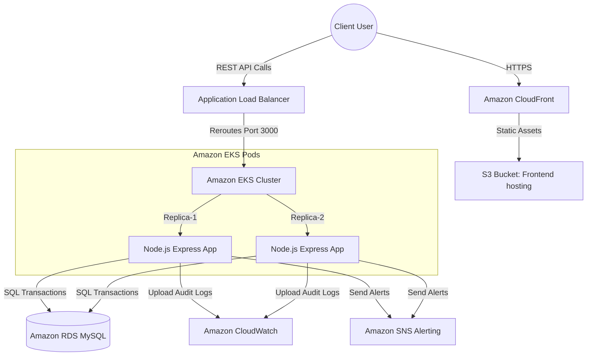

# AWS Cloud & DevOps Architecture Blueprint

## 1. Project Overview
The **Cloud-Based Personal Expense Tracker** is a state-of-the-art Single Page Application (SPA) designed to help clients manage, audit, and analyze their personal transaction nodes. Backed by a full-stack Express API and persistent relational models, this platform simulates real-time financial tracking and compiles interactive analytics trends, preparing developers for modern **FinOps** environments.

---

## 2. Problem Statement
Many personal finance trackers are client-only local utilities that lack durable, scalable persistence, cloud-readiness, and security credentials. During internship submissions, projects often fail to demonstrate operational DevOps specifications (such as containerizations, automated pipelines, or orchestrated Kubernetes cluster setups). This project bridges the gap by building a robust, SOC2-ready architecture designed specifically for AWS cloud environments.

---

## 3. Objectives
- **Secure Cloud Storage:** Implement relational modeling representing cascading constraints for AWS RDS MySQL.
- **Micro-Services Orchestration:** Containerize frontend and backend layers with Docker and Docker-Compose.
- **Rolling EKS Deployments:** Establish declarative Kubernetes configuration manifests for Namespace, ConfigMaps, Secrets, Deployments, Services, and Ingress routing.
- **CI/CD Pipelines:** Implement Github Actions to automate ECR deployments and EKS rollouts.

---

## 4. Architectural Design (AWS & DevOps)



### Infrastructure Workflow Description:
1. **Frontend Assets:** React application static files compiled with Vite are hosted on **Amazon S3** and distributed worldwide via **Amazon CloudFront** edge caches.
2. **API Endpoint Router:** The public routes are managed by an **Application Load Balancer (ALB)**, routing traffic seamlessly into the private VPC subnet.
3. **Orchestrated Application Node:** The backend Node server runs in highly resilient pods managed by **Amazon EKS** with standard rolling-update deployment mechanisms.
4. **Relational Database Cluster:** Active transaction nodes write to **Amazon RDS MySQL** with Multi-AZ configurations.

---

## 5. Relational Database Design
The schema operates three core tables with index structures to maximize query execution speeds:

```sql
-- Users Table
CREATE TABLE users (
  id VARCHAR(50) NOT NULL PRIMARY KEY,
  name VARCHAR(100) NOT NULL,
  email VARCHAR(150) NOT NULL UNIQUE,
  password VARCHAR(255) NOT NULL,
  created_at TIMESTAMP DEFAULT CURRENT_TIMESTAMP
);

-- Categories Table
CREATE TABLE categories (
  id VARCHAR(50) NOT NULL PRIMARY KEY,
  name VARCHAR(100) NOT NULL,
  icon VARCHAR(50) DEFAULT 'HelpCircle',
  color VARCHAR(10) DEFAULT '#3b82f6',
  is_custom BOOLEAN DEFAULT FALSE,
  user_id VARCHAR(50) DEFAULT NULL,
  FOREIGN KEY (user_id) REFERENCES users(id) ON DELETE CASCADE
);

-- Expenses Table
CREATE TABLE expenses (
  id VARCHAR(50) NOT NULL PRIMARY KEY,
  user_id VARCHAR(50) NOT NULL,
  category_id VARCHAR(50) NOT NULL,
  amount DECIMAL(12, 2) NOT NULL,
  description VARCHAR(255) DEFAULT '',
  date DATE NOT NULL,
  payment_method VARCHAR(50) NOT NULL,
  created_at TIMESTAMP DEFAULT CURRENT_TIMESTAMP,
  FOREIGN KEY (user_id) REFERENCES users(id) ON DELETE CASCADE,
  FOREIGN KEY (category_id) REFERENCES categories(id) ON DELETE RESTRICT
);
```

---

## 6. REST API Specifications

### Authentication Routes:
- `POST /api/auth/register` - Create user node.
- `POST /api/auth/login` - Validate credentials and issue JWT.
- `GET /api/auth/me` - Resolve active token to verify IAM profiles.
- `PUT /api/auth/profile` - Modify display name or contact parameters.
- `PUT /api/auth/change-password` - Reset passphrase.

### Expense Node Routes:
- `POST /api/expenses` - Append a new spend node.
- `GET /api/expenses` - Retrieve filtered database records.
- `PUT /api/expenses/:id` - Modify an existing expense record.
- `DELETE /api/expenses/:id` - Wipe an expense.

### Category Routes:
- `GET /api/categories` - Fetch active budget classifications.
- `POST /api/categories` - Provision user-custom category nodes.

### Analytics Routes:
- `GET /api/dashboard` - Get totals, line trends, and percentage distribution.
- `GET /api/reports` - Get fiscal summaries by month, category, and year.

---

## 7. Future Enhancements & Conclusion
- **OCR Receipt Analysis:** Integrate AWS Textract to automatically read receipts and classify items.
- **Budget Alerts:** Setup Amazon SNS SMS alerts if expenditures cross user thresholds.
- **Relational SQL caching:** Integrate Amazon ElastiCache Redis to speed up analytics queries.

In conclusion, this project provides a clean production blueprint demonstrating advanced full-stack systems engineering, containerizations, and standard multi-region cloud architectural practices suitable for professional internships.
